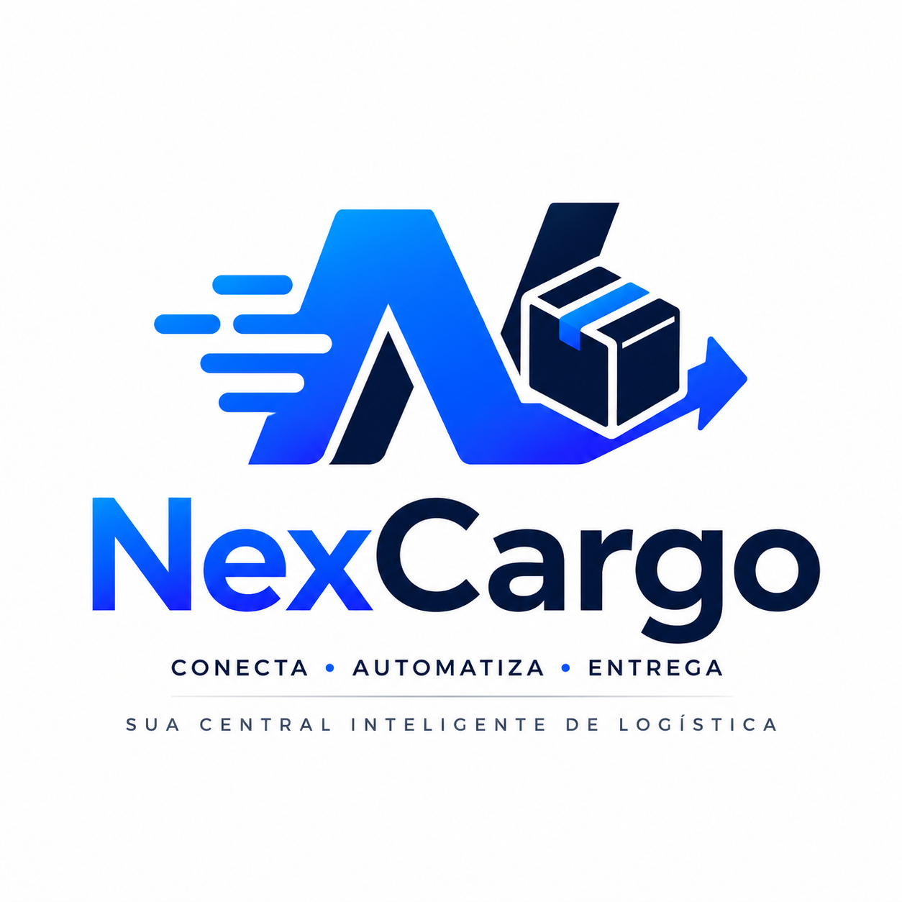

<p align="center">
  
</p>

# NexCargo

> **Central Operacional Inteligente de Logística**
> Plataforma SaaS multi-tenant para transportadoras, delivery urbano e operadores logísticos regionais.

---

## Visão Geral

O NexCargo foi construído para ser o **cérebro operacional** de pequenas e médias empresas de logística. Diferente de ERPs engessados, o NexCargo oferece:

- ✅ WhatsApp como central de comunicação
- ✅ Automação real de notificações e atendimento
- ✅ Rastreamento em tempo real
- ✅ Dashboard operacional com métricas ao vivo
- ✅ Multi-tenant — cada empresa tem seus dados isolados
- ✅ IA integrada para atendimento e previsões
- ✅ Arquitetura escalável e preparada para crescimento

---

## Funcionalidades do MVP

| Módulo | Funcionalidades |
|---|---|
| **Pedidos** | Criar, listar, filtrar, atualizar status, histórico de eventos |
| **Rastreamento** | Página pública sem login, linha do tempo de eventos |
| **Etiqueta** | Geração de etiqueta A5 para impressão / PDF |
| **WhatsApp** | Conexão via QR Code, notificações automáticas por evento |
| **Clientes** | Cadastro completo, histórico de pedidos, observações |
| **Dashboard** | Métricas em tempo real, gráfico de entregas, painel de SLA |
| **Relatórios** | Resumo gerencial por período, exportação CSV para Excel |
| **Autenticação** | Login, logout, recuperação de senha, proteção de rotas |

---

## Stack Tecnológica

### Frontend
| Tecnologia | Uso |
|---|---|
| [Next.js 14](https://nextjs.org) | Framework React com App Router e SSR |
| [TypeScript](https://typescriptlang.org) | Tipagem estática |
| [Tailwind CSS](https://tailwindcss.com) | Estilização |
| [TanStack Query](https://tanstack.com/query) | Cache e sincronização de dados |
| [React Hook Form + Zod](https://react-hook-form.com) | Formulários com validação |
| [Recharts](https://recharts.org) | Gráficos |

### Backend & Banco
| Tecnologia | Uso |
|---|---|
| [Supabase](https://supabase.com) | PostgreSQL + Auth + RLS multi-tenant |
| [Redis](https://redis.io) | Filas de tarefas e cache |

### Automação & Comunicação
| Tecnologia | Uso |
|---|---|
| [N8N](https://n8n.io) | Workflows de automação (notificações, integrações) |
| [Evolution API](https://evolution-api.com) | Integração WhatsApp |

### Infraestrutura
| Tecnologia | Uso |
|---|---|
| [Docker](https://docker.com) | Containerização |
| [Nginx](https://nginx.org) | Proxy reverso + SSL |
| [Coolify](https://coolify.io) | Deploy e gerenciamento no servidor |
| VPS [Contabo](https://contabo.com) | Hospedagem |

---

## Arquitetura

```
NexCargo/
├── apps/
│   └── web/                    # Next.js — frontend + API Routes
│       └── src/
│           ├── app/            # Páginas e rotas
│           │   ├── (auth)/     # Login, recuperação de senha
│           │   ├── (dashboard)/# Área logada (pedidos, clientes...)
│           │   ├── (public)/   # Rastreamento público
│           │   └── api/        # API Routes (backend)
│           ├── components/     # Componentes React
│           ├── hooks/          # Custom hooks
│           ├── lib/            # Clientes externos (Supabase, Evolution)
│           ├── services/       # Camada de serviços
│           └── middleware.ts   # Proteção de rotas
├── packages/
│   └── shared/                 # Tipos TypeScript compartilhados
├── supabase/
│   └── migrations/             # Schema SQL + RLS + seed
├── n8n/
│   └── workflows/              # Workflows de automação exportados
├── infra/
│   ├── docker/                 # Docker Compose dev e produção
│   ├── nginx/                  # Configuração do proxy reverso
│   └── scripts/                # Scripts de deploy
└── docs/
    └── setup/                  # Documentação de instalação e deploy
```

---

## Como rodar localmente

### Pré-requisitos

- [Node.js 20+](https://nodejs.org)
- [Docker Desktop](https://www.docker.com/products/docker-desktop)
- Conta no [Supabase](https://supabase.com) (gratuita)

### 1. Clone o repositório

```bash
git clone https://github.com/etitecnologies-sketch/NexCargo.git
cd NexCargo
```

### 2. Configure as variáveis de ambiente

```bash
cp .env.example .env
# Abra o .env e preencha as chaves do Supabase
```

### 3. Suba os serviços com Docker

```bash
npm run docker:up
```

Isso inicia:
| Serviço | URL | Descrição |
|---|---|---|
| PostgreSQL | `localhost:5432` | Banco de dados |
| Redis | `localhost:6379` | Filas e cache |
| N8N | http://localhost:5678 | Automações |
| Evolution API | http://localhost:8080 | WhatsApp |

### 4. Instale as dependências

```bash
npm install
```

### 5. Execute as migrações do banco

```bash
npm run db:migrate
```

### 6. Inicie o servidor de desenvolvimento

```bash
npm run dev
```

Acesse: **http://localhost:3000**

---

## Variáveis de Ambiente

Copie `.env.example` para `.env` e preencha:

```env
# Supabase
NEXT_PUBLIC_SUPABASE_URL=https://SEU_PROJETO.supabase.co
NEXT_PUBLIC_SUPABASE_ANON_KEY=sua_chave_anonima
SUPABASE_SERVICE_ROLE_KEY=sua_chave_secreta

# WhatsApp (Evolution API)
EVOLUTION_API_URL=http://localhost:8080
EVOLUTION_API_KEY=sua_chave

# IA
OPENAI_API_KEY=sk-...
ANTHROPIC_API_KEY=sk-ant-...

# Redis
REDIS_URL=redis://localhost:6379
```

> ⚠️ **Nunca suba o arquivo `.env` para o Git.** Ele já está no `.gitignore`.

---

## Fluxo de Notificações WhatsApp

```
Pedido criado/atualizado
        ↓
API registra notificação pendente no banco
        ↓
N8N verifica pendentes a cada 30s
        ↓
N8N formata mensagem personalizada
        ↓
Evolution API envia via WhatsApp
        ↓
Status atualizado para "enviado"
```

Mensagens automáticas enviadas:
- ✅ Pedido criado — confirmação + link de rastreio
- ✅ Coletado — aviso de coleta
- ✅ Em trânsito — previsão de entrega
- ✅ Saiu para entrega — alerta para ficar em casa
- ✅ Entregue — confirmação
- ✅ Falha — aviso + próximos passos

---

## Multi-tenant

Cada empresa cliente (tenant) tem seus dados **completamente isolados** no banco de dados através de **Row Level Security (RLS)** no PostgreSQL:

- O token JWT carrega o `tenant_id`
- O banco bloqueia automaticamente acesso cruzado entre empresas
- Mesmo que haja um bug no código, o banco garante o isolamento

---

## Deploy em Produção

Veja o guia completo em [`docs/setup/DEPLOY.md`](docs/setup/DEPLOY.md).

Resumo rápido para VPS + Coolify:

```bash
# No servidor
bash infra/scripts/deploy.sh
```

---

## Roadmap

- [ ] Módulo Financeiro (cobranças, faturamento, mensalidades)
- [ ] IA para previsão de atraso
- [ ] Atendimento automático via WhatsApp com IA
- [ ] App mobile para entregadores
- [ ] Integração com Correios / transportadoras parceiras
- [ ] Portal do cliente (acompanhamento de pedidos)
- [ ] Multi-idioma

---

## Licença

Proprietário — todos os direitos reservados © 2026 NexCargo / ETI Tecnologias.

---

<p align="center">
  Feito com foco em logística regional brasileira 🇧🇷
</p>
